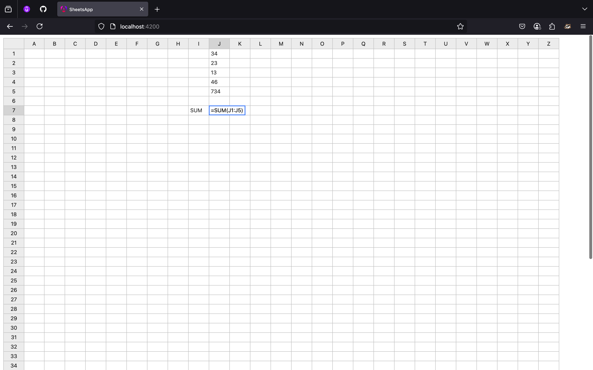
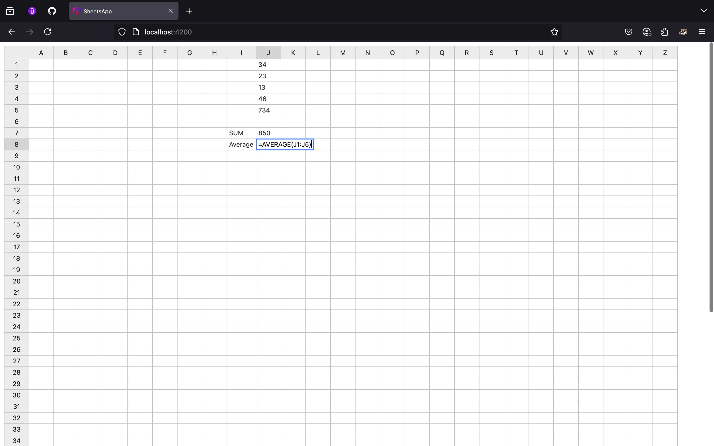
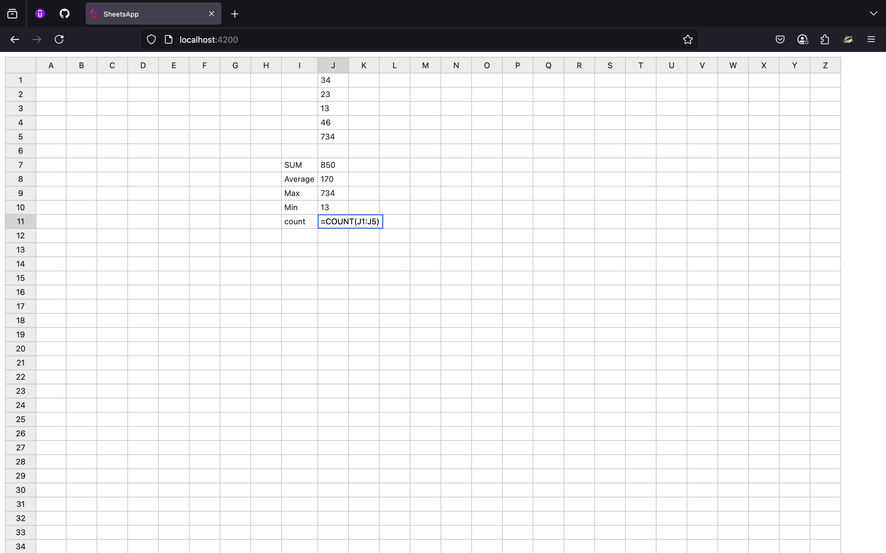

# SheetsApp

To get this project running simply follow below steps

1. CLone this repository
   ```shell
   git clone https://github.com/abhijeet-Bh/sheet-app.git
   ```
2. install dependencies
   ```shell
   cd sheet-app
   npm install
   ```
3. run the project

   ```shell
   ng serve
   ```

Now, you'll have this sheet app running

Screenhsots:



